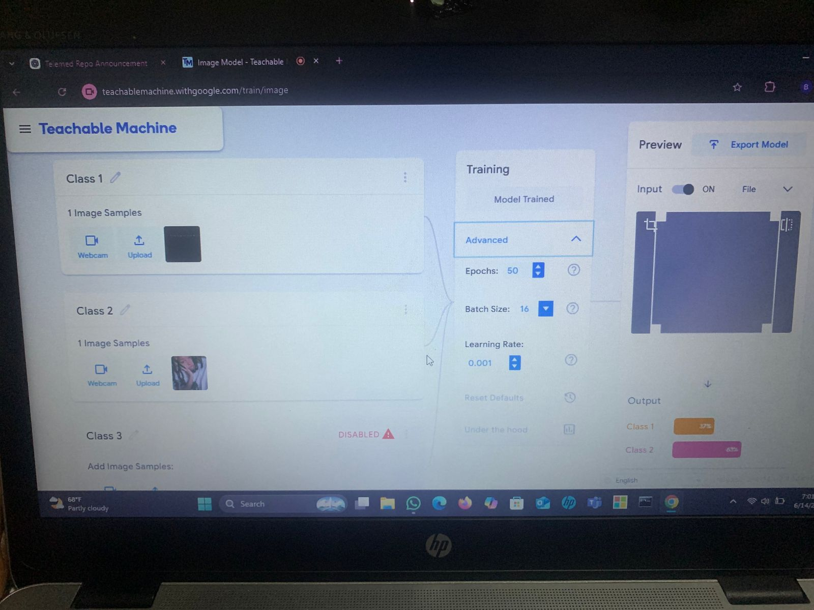

# Assignment 1 & 2 Reflection

## Model 1
Epochs: 50  
Batch Size: 16  
The model performed fairly well but sometimes made incorrect predictions.
screenshot:
## Model 2
Epochs: 100  
Batch Size: 16  
The model had better accuracy and more consistent predictions.

## Model 3
Epochs: 50  
Batch Size: 16
The model trained faster but was slightly less accurate.
screenshot:

## What I Learned
I learned that changing hyperparameters affects how the model performs. Increasing epochs improves accuracy, while batch size affects speed and performance.
