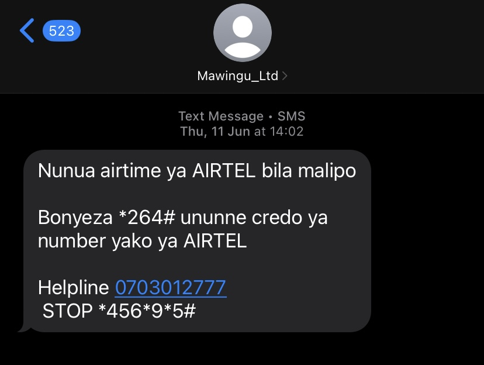

## Spam Mail 1

- **Subject:** Hurry — 50% off ends soon!  
- **Sender:** Flo  
- **Date Received:** 31 May 2026  
- **Screenshot:**  

- **Severity:** Moderate Risk  

- **Reason for Rating:**  
This email creates urgency by stating that the discount is ending soon. It is a promotional message designed to encourage quick action without giving the user enough time to think carefully.

- **Reflection Note:**  
Although this email may be from a legitimate service, it still uses marketing pressure tactics that can lead users to click links without verifying them. I would be cautious before clicking and ensure the source is trustworthy.
## Spam Mail 2

- **Subject:** Don’t forget to claim your discount!  
- **Sender:** Flo  
- **Date Received:** 30 May 2026  
- **Screenshot:**   

- **Severity:** Moderate Risk  

- **Reason for Rating:**  
This email tries to remind the user to claim a discount, which can push users into taking action quickly. Repeated promotional emails can increase the chances of users clicking links without verifying them.

- **Reflection Note:**  
This email is not clearly malicious but still represents a potential risk because it encourages repeated engagement. I would avoid clicking links unless I confirm the sender is legitimate.
## Spam Mail 3

- **Subject:** Activate your account at Triaba Kenya  
- **Sender:** Triaba Kenya  
- **Date Received:** 12 May 2025  
- **Screenshot:**   

- **Severity:** Moderate Risk  

- **Reason for Rating:**  
This email asks me to activate an account, but I do not recall signing up for this service. Receiving unexpected account-related emails can be suspicious and may indicate phishing attempts.

- **Reflection Note:**
- The email is quite malicious hence i will not click the link.
- ##spam 4
  Mawingu Ltd SMS - Airtel Airtime  
Subject: Nunua airtime ya AIRTEL bila malipo  
Sender: Mawingu_Ltd  
Date: Thu, 11 Jun at 14:02  
Screenshot Link:  
Severity Rating: Medium  
Reason for Rating: Promises “free airtime” + uses USSD code _264# + suspicious helpline 0703012777. Legit telcos don’t give free airtime via random USSD. Risk of SIM-swap or charges.  
Reflection Note: I learned to be suspicious of “free” offers via SMS. Always confirm USSD codes with official telco channels.  

---
##spam 5
PARISTAKINF SMS - Freebet Alert  
Subject: FREEBET ALERT!  
Sender: PARISTAKINF  
Date: Mon, 18 May at 12:59 / Thu, 21 May / Thu, 28 May  
Screenshot Link: Paristakinf.png  
Severity Rating: High  
Reason for Rating: Uses “Congratulations + Ksh 1000 FREE” + repeated messages + link to http://paristake.com/signup. Phishing tactic to collect personal data + gambling addiction bait.  
Reflection Note: Spam often repeats messages to pressure you. Real betting companies don’t spam “you won” before you register.  

---
##spam 6
ChezaGameSP SMS - Free Bonus  
Subject: Free Bonus confirmed  
Sender: ChezaGameSP  
Date: Sat, 16 May at 17:37  
Screenshot Link: ChezaGameSP.png  
Severity Rating: Medium  
Reason for Rating: Unsolicited “guaranteed bonus” + link to Chezagam http://e.com + casino mention. Likely spam/gambling promo harvesting numbers.  
Reflection Note: I now check if I actually signed up before trusting “confirmed bonus” messages.  

---
##spam 7
ChezaGameKE SMS - Welcome Bonus  
Subject: CONGRATULATIONS! YOU HAVE RECEIVED 1,000KSH  
Sender: ChezaGameKE  
Date: Fri, 8 May / Sat, 9 May / Mon, 11 May  
Screenshot Link: ChezaGameKE.png  
Severity Rating: High  
Reason for Rating: Multiple messages claiming money received + asks to “Deposit any amount”. Classic advance-fee scam. Tries to make you deposit to “unlock” fake money.  
Reflection Note: If I didn’t play, I can’t win. Never deposit to claim a “prize”.  

---
##spam 8
CREDFastLTD SMS - M-PESA Loan  
Subject: MPESA CONFIRMED  
Sender: CREDFastLTD  
Date: Sun, 3 May at 10:28  
Screenshot Link: CREDFastLTD.png  
Severity Rating: Critical  
Reason for Rating: Fake M-PESA confirmation + offers Ksh 184,240 loan + asks to dial _329*44# + sends money to personal number 254706068218. Loan fraud + SIM swap risk.  
Reflection Note: M-PESA never sends loan approvals via random SMS. I learned to verify loans only through official M-PESA app/menu.  

---
##spam 9
SportPesa. SMS - Mega Jackpot  
Subject: Shinda 117 million SportPesa Mega Jackpot  
Sender: SportPesa.  
Date: Sat, 28 Feb at 12:55  
Screenshot Link: SportPesa.png  
Severity Rating: Low-Medium  
Reason for Rating: Legit brand name but uses shortened link http://spp.ke/Jackpotb + urges “SMS D#99”. Could be real promo or spoofed. Short links hide destination.  
Reflection Note: Even known brands can be spoofed. I’ll avoid short links and go directly to http://sportpesa.com instead.  

---
##spam 10
TUSHINDE SMS - Deposit Request  
Subject: Sasa BEVAN, deposit ya KSh 24  
Sender: TUSHINDE  
Date: Tue, 24 Mar at 16:42  
Screenshot Link: TUSHINDE.png  
Severity Rating: Medium  
Reason for Rating: Addresses you by name + asks for KSh 24 deposit + reference code + link. Personalized = likely data leak. Small amount is a “test” to see if you’ll pay.  
Reflection Note: Personalization doesn’t mean it’s legit. If I didn’t expect it, I won’t deposit.  
