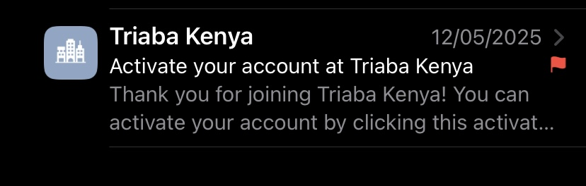
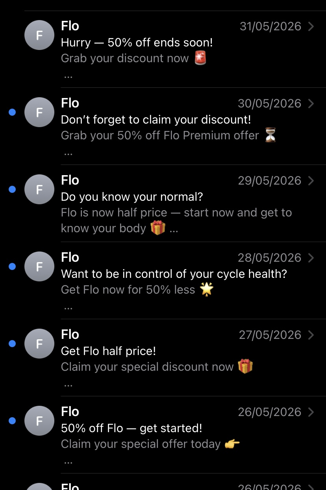

## Spam Mail 1

- **Subject:** Hurry — 50% off ends soon!  
- **Sender:** Flo  
- **Date Received:** 31 May 2026  
- **Screenshot:**  

- **Severity:** Moderate Risk  

- **Reason for Rating:**  
This email creates urgency by stating that the discount is ending soon. It is a promotional message designed to encourage quick action without giving the user enough time to think carefully.

- **Reflection Note:**  
Although this email may be from a legitimate service, it still uses marketing pressure tactics that can lead users to click links without verifying them. I would be cautious before clicking and ensure the source is trustworthy.
## Spam Mail 2

- **Subject:** Don’t forget to claim your discount!  
- **Sender:** Flo  
- **Date Received:** 30 May 2026  
- **Screenshot:**   

- **Severity:** Moderate Risk  

- **Reason for Rating:**  
This email tries to remind the user to claim a discount, which can push users into taking action quickly. Repeated promotional emails can increase the chances of users clicking links without verifying them.

- **Reflection Note:**  
This email is not clearly malicious but still represents a potential risk because it encourages repeated engagement. I would avoid clicking links unless I confirm the sender is legitimate.
## Spam Mail 3

- **Subject:** Activate your account at Triaba Kenya  
- **Sender:** Triaba Kenya  
- **Date Received:** 12 May 2025  
- **Screenshot:**   

- **Severity:** Moderate Risk  

- **Reason for Rating:**  
This email asks me to activate an account, but I do not recall signing up for this service. Receiving unexpected account-related emails can be suspicious and may indicate phishing attempts.

- **Reflection Note:**
- The email is quite malicious hence i will not click the link.
- 
